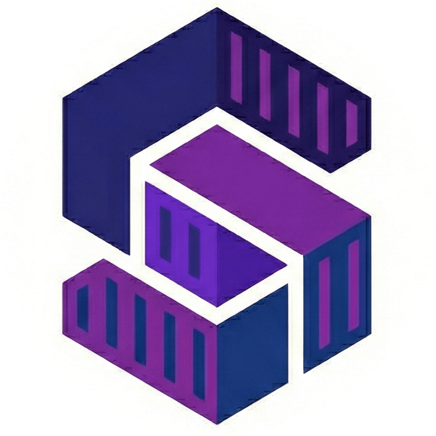
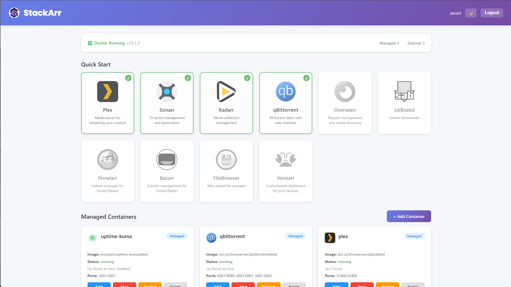
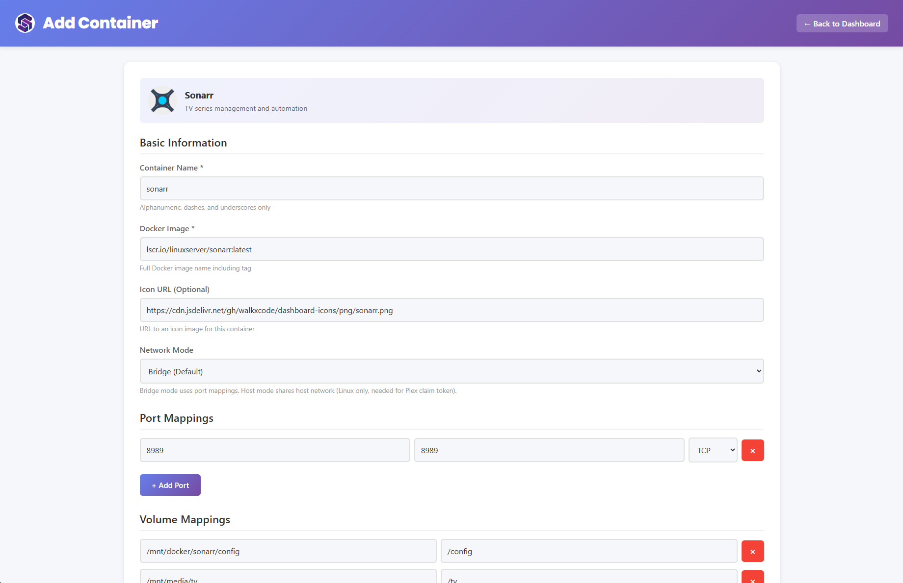

# StackArr

<div align="center">
  
  
  **A modern, web-based Docker container management interface**
  
  [](https://go.dev)
  [](LICENSE)
</div>

## Overview

StackArr is a lightweight, self-hosted web application for managing Docker containers with a focus on media server stacks (Plex, Sonarr, Radarr, qBittorrent, etc.). Built with Go and featuring a clean, modern interface, it makes Docker container management accessible without requiring command-line expertise.

### Key Features

- **Quick Start Templates** - One-click deployment of popular media server applications
- **Container Management** - Create, start, stop, restart, and delete containers with ease
- **Visual Interface** - Clean, modern UI with dark mode support
- **Lightweight** - Single binary deployment with no external dependencies
- **Port Management** - Automatic port conflict detection
- **Docker Compose** - Full docker-compose.yml support for each container
- **External Container Monitoring** - View and control containers created outside StackArr

### Pre-configured Service Templates

StackArr includes ready-to-deploy templates for:

- **Plex** - Media streaming server
- **Sonarr** - TV series management
- **Radarr** - Movie management
- **qBittorrent** - Torrent client
- **Overseerr** - Request management
- **SABnzbd** - Usenet downloader
- **Prowlarr** - Indexer manager
- **Bazarr** - Subtitle management
- **FileBrowser** - Web-based file manager
- **Homarr** - Dashboard for your services

## Screenshots

### Dashboard


### Container Management


## Installation

### Prerequisites

- **Docker** installed and running (StackArr will guide you through installation if needed)
- **Go 1.21+** (only for building from source)

### Method 1: Docker Hub (Recommended)

The easiest way to run StackArr is pulling the pre-built image from Docker Hub:

```bash
docker run -d \
  --name stackarr \
  -p 8877:8877 \
  -v /var/run/docker.sock:/var/run/docker.sock \
  -v stackarr-data:/app/data \
  -v /mnt:/mnt \
  --restart unless-stopped \
  danielvanniekerk/stackarr:latest
```

**Using docker-compose:**
```yaml
version: '3.8'
services:
  stackarr:
    image: danielvanniekerk/stackarr:latest
    container_name: stackarr
    ports:
      - "8877:8877"
    volumes:
      - /var/run/docker.sock:/var/run/docker.sock
      - stackarr-data:/app/data
      - /mnt:/mnt
    restart: unless-stopped

volumes:
  stackarr-data:
```

Access StackArr at `http://localhost:8877`

**Important Notes:**
- StackArr needs access to `/var/run/docker.sock` to manage Docker containers
- Mount `/mnt` or your media paths so containers created by StackArr can access them
- The `stackarr-data` volume persists your database and container configurations at `/app/data`

**Version Pinning:**
You can use specific version tags instead of `latest`:
```bash
docker pull danielvanniekerk/stackarr:1.0.0  # Specific version
docker pull danielvanniekerk/stackarr:1.0    # Minor version
docker pull danielvanniekerk/stackarr:1      # Major version
docker pull danielvanniekerk/stackarr:latest # Latest release
```

### Method 2: Build from Source

If you prefer to build from source:

```bash
# Clone the repository
git clone https://github.com/daniel-van-niekerk/stackarr.git
cd stackarr

# Start with docker-compose
docker-compose up -d
```

### Method 3: Binary

Build and run StackArr as a standalone binary:

```bash
# Clone the repository
git clone https://github.com/daniel-van-niekerk/stackarr.git
cd stackarr

# Build the binary
go build -o stackarr ./cmd/stackarr

# Run StackArr
./stackarr
```

StackArr will start on `http://localhost:8877` by default.

### First-Time Setup

1. Navigate to `http://localhost:8877`
2. Create your admin account
3. If Docker is not installed, follow the integrated installation guide
4. Start deploying containers!

### Password Recovery

If you lose access to your admin account, you can reset all users using an environment variable:

**Docker:**
```bash
docker stop stackarr
docker run -d \
  --name stackarr \
  -e RESET_USER=confirm-delete-user \
  -p 8877:8877 \
  -v /var/run/docker.sock:/var/run/docker.sock \
  -v stackarr-data:/app/data \
  danielvanniekerk/stackarr:latest
```

**Docker Compose:**
```yaml
services:
  stackarr:
    image: danielvanniekerk/stackarr:latest
    environment:
      - RESET_USER=confirm-delete-user
    # ... other configuration
```

**Binary:**
```bash
RESET_USER=confirm-delete-user ./stackarr
```

**Important:**
- The value MUST be exactly `confirm-delete-user` (case-sensitive)
- This will delete ALL users from the database
- After deletion, navigate to `http://localhost:8877` to create a new admin account
- Remove the environment variable after reset to prevent accidental resets
- Check application logs for confirmation of the reset action

## Usage

### Adding Containers

**Quick Start (Recommended)**
1. Click on any service card in the "Quick Start" section
2. Configure paths and ports
3. Click "Create Container"

**Custom Containers**
1. Click "+ Add Container" in the "Managed Containers" section
2. Specify image, ports, volumes, and environment variables
3. Click "Create Container"

### Managing Containers

- **Start/Stop/Restart** - Use the action buttons on each container card
- **Edit** - Modify container configuration (requires restart)
- **Delete** - Remove container and its docker-compose file

### Dark Mode

Toggle between light and dark themes using the sun/moon button in the header. Your preference is saved per user.

## Configuration

StackArr uses SQLite for data storage and creates the following directory structure:

```
/app/data/
├── stackarr.db           # Database file
└── compose/              # Docker-compose files for each container
    ├── plex.yml
    ├── sonarr.yml
    └── ...
```

### Default Ports

- **Web Interface**: 8877
- **Database**: SQLite (no network port)

You can change the port by setting the `PORT` environment variable:

```bash
PORT=3000 ./stackarr
```

## Development

### Building from Source

```bash
# Clone the repository
git clone https://github.com/daniel-van-niekerk/stackarr.git
cd stackarr

# Install dependencies
go mod download

# Run in development mode
go run ./cmd/stackarr

# Build for production
go build -ldflags="-s -w" -o stackarr ./cmd/stackarr
```

### Running Tests

```bash
go test ./...
```

## Security Considerations

- StackArr requires access to the Docker socket (`/var/run/docker.sock`)
- Passwords are hashed using bcrypt
- Sessions use secure HTTP-only cookies
- CSRF protection on all state-changing operations
- By default, binds to `127.0.0.1` (localhost only)

### Remote Access

For remote access, use a reverse proxy like nginx or Caddy with HTTPS:

```nginx
server {
    listen 443 ssl;
    server_name stackarr.yourdomain.com;

    ssl_certificate /path/to/cert.pem;
    ssl_certificate_key /path/to/key.pem;

    location / {
        proxy_pass http://127.0.0.1:8877;
        proxy_set_header Host $host;
        proxy_set_header X-Real-IP $remote_addr;
    }
}
```

## Roadmap

- [x] Asynchronous container create/update progress
- [x] User recovery
- [ ] Container logs viewer
- [ ] Backup/restore functionality
- [ ] Volume browser
- [ ] Image update notifications

## Contributing

Contributions are welcome! Please feel free to submit a Pull Request.

1. Fork the repository
2. Create your feature branch (`git checkout -b feature/amazing-feature`)
3. Commit your changes (`git commit -m 'Add some amazing feature'`)
4. Push to the branch (`git push origin feature/amazing-feature`)
5. Open a Pull Request

## License

This project is licensed under the MIT License - see the [LICENSE](LICENSE) file for details.

## Acknowledgments

- [LinuxServer.io](https://www.linuxserver.io/) for their excellent Docker images
- [Dashboard Icons](https://github.com/walkxcode/dashboard-icons) for service icons
- The Go and Docker communities for their amazing tools and libraries

## Support

- **Issues**: [GitHub Issues](https://github.com/daniel-van-niekerk/stackarr/issues)
- **Discussions**: [GitHub Discussions](https://github.com/daniel-van-niekerk/stackarr/discussions)

---

<div align="center">
  Made with ❤️ for the self-hosted community
</div>
